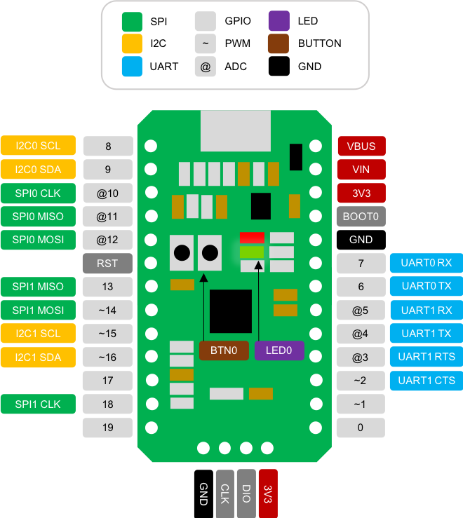
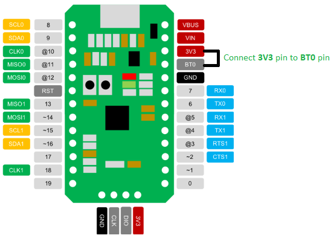
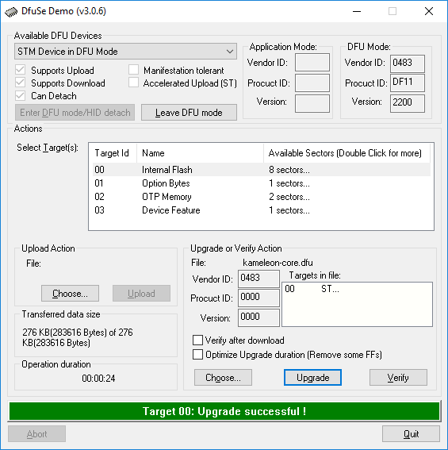
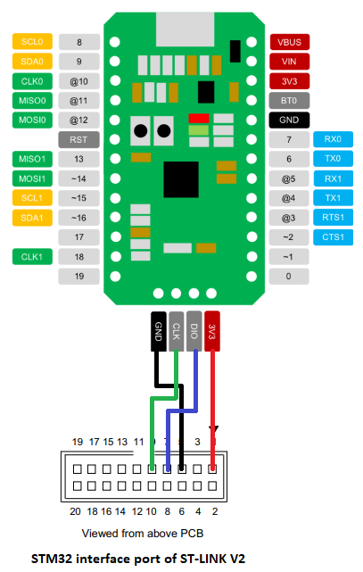
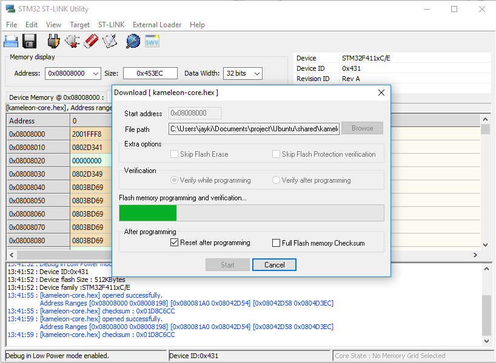

# Kameleon Core

## Overview

Kameleon core is a small-sized and powerful electronics development board that runs Kameleon JavaScript runtime. It can be connected to PC via micro USB-cable and controlled by typical terminal program as well as Kameleon Web-based IDE.

## Pinmap



## Specifications

|  |  |
| :--- | :--- |
| Size | 38mm x 21mm |
| Microcontroller | STM32F411CEU6 \(ARM 32-bit Cortex M4\) |
| Clock Speed | 96MHz |
| Operating Voltage | 3.3V |
| Input Voltage | 3.55V ~ 6V |
| Flash Memory | 512KB \(80KB for user code\) |
| RAM | 128KB |
| GPIO | 20 \(Up to 20mA for Pin 0~19, 3mA for Pin 19\) . |
| PWM | 5 \(450KHz ~ 1Hz\) |
| ADC | 6 |
| I2C | 2 |
| SPI | 2 |
| UART | 2 |
| On-board LEDs | 2 \(1 for power, 2 for user\) |
| On-board Buttons | 2 \(1 for reset, 1 for user\) |

## Power

You could supply the power through Micro USB Port or VBUS pin. The operation input voltage is minimum 3.55V, maximum 6V and maximum 500mA current \(500mA resettable fuse is on the board\) is capable for this board. If you drive the high current device like a big motor, you have to use the external power source with a relay circuit.

Micro-USB type B \(5V\) input is the most convenient way to supply the power. You can use the Travel Adapter for your smartphone \(5V, 500mA or higher\) or USB2.0/3.0 port which can supply more than 500mA. If you want to use the battery for the production, you should consider the voltage \(3.55V ~ 6.0V\) and current \(up to your application\).

## Pull-Up Resistors for I2C

A pull-up resistors are needed for I2C SCL and SDA pin and external pull-up resistors are recommended for Kameleon Core.

For your convenience, Kameleon Core I2C port has 40 KOhm internal pull-up resistor. You may not need external pull-up resistor if your I2C clock speed is low enough \(internal pull-up may be enough if the clock is low\)

For the high speed I2C operation, you have to use external pull-up resistor. The 10 KOhm resistor is enough to operate I2C fast mode \(400 kHz\) in most cases. Since there are internal resistors, the total pull-up resistor value is the parallel resistance of internal and external pull-up resistor. If you put 10 KOhm external pull-up resistors, the total pull-up resistance is 8 KOhm. \(the parallel resistance of 40 KOhm and 10 KOhm\)

The Kameleon Core has pads for I2C external pull-up resistors. You could put 0603 SMD type resistors on the Kameleon Core. The pads for the pull-up resistors are shown below.

## Skip to load code at startup

As you know your code uploaded in flash memory, the code will be loaded and executed automatically at startup. Sometime you need to skip loading the code. For example, the code has a bug causing system stuck.

So you need a way to skip to load your code in flash. To skip to load your code at startup, supply power \(connect USB cable\) or press RST \(reset\) button in Kameleon Core board while keep pressing the BTN0 button.

## Firmware Update

Typically firmware is automatically updated by Kameleon Agent and Kameleon Web Editor. Nonetheless to update firmware manually, please proceed the following instructions:

### Firmware update using Kameleon CLI tool via USB port.

1. Install [Kameleon CLI \(Command Line Interface\)](https://github.com/kameleon-project/kameleon-cli).

   ```bash
   $ npm install -g kameleon-cli
   ```

2. Download latest firmware binary from releases page of the [Github repository](https://github.com/kameleon-project/kameleon/releases) of Kameleon JavaScript runtime. \(e.g. `kameleon-core.bin` for Kameleon Core board\).
3. Update firmware using Kameleon CLI.

```bash
$ kameleon update <firmware> -p <port>
# e.g.) kameleon update kameleon-core.bin -p /dev/tty.usb001A
# e.g.) kameleon update kameleon-core.bin -p COM6
```

### Firmware update using DfuSe Demo tool via USB port.

_Windows OS only, Provided by ST-Micro._

1. Download and install [DefSe Demo tool](https://www.st.com/content/st_com/en/products/development-tools/software-development-tools/stm32-software-development-tools/stm32-programmers/stsw-stm32080.html).
2. Install STM DFU mode driver.

   _The driver installation file is in the_ `C:\Program Files (x86)\STMicroelectronics\Software\DfuSe v3.0.6\Bin\Driver` _folder._

3. Supply 3.3V to BT0\(BOOT0\) pin on the Kameleon Core board and tune it on using PC USB port in order to go into STM DFU mode.

    

4. Check "STM Device in DFU Mode" USB controller in windows Device Manger.
5. Generate DFU file, `kameleon-core.dfu` from the firmware hex file, `kameleon-core.hex` using Dfu File Manager tool.
   1. Run DFU file manager tool and select "I want to GENERATE a DFU file from S19, HEX or BIN files".
   2. Click "S19 or Hex..." button and select `kameleon-core.hex`file.
   3. Click "Generate..." button and write the DFU file name like `kameleon-core.dfu`.
6. Run [DefSe Demo tool](https://www.st.com/content/st_com/en/products/development-tools/software-development-tools/stm32-software-development-tools/stm32-programmers/stsw-stm32080.html) and open the DFU file, `kameleon-core.dfu`.
   1. Click "Choose..." button in the "Upgrade or Verify Action" box and select the `kameleon-core.dfu`.
7. Update\(Upgrade\) the firmware.

   1. Check "Verify after download" checkbox in the "Upgrade or Verify Action" box.
   2. Click "Upgrade" button in the "Upgrade or Verify Action" box to update the firmware.
   3. Check the "Target 00: Upgrade successful !" message.

    

8. Remove 3.3V input of the BT0\(BOOT0\) pin on the Kameleon Core board and reset the board.

### Firmware update using ST-Link/V2 via SWD port \(Windows OS only, Provided by ST-Micro\)

_Must have_ [_ST-LINK/V2 in-circuit debugger/programmer for STM32_](https://www.st.com/en/development-tools/st-link-v2.html)_. Windows OS only, Provided by ST-Micro._

1. Download and install [STM32 ST-LINK Utility](https://www.st.com/content/st_com/en/products/development-tools/software-development-tools/stm32-software-development-tools/stm32-programmers/stsw-link004.html)
2. Connect Kameleon SWD port to ST-LINK/V2 port

    

3. Run STM32 ST-LINK Utility
4. Select the "Connect" in the "Target" menu.
5. Select the "Program & Verify..." in the "Target" menu.
6. Click "Browse" button and select `kameleon-core.hex`file and click "Start" button to update firmware.

    

## Bootloader Update

Bootloader code could be updated using DfuSe Demo tool or ST Link/V2 tool. All the process is the same as firmware update except the `kameleon-core-bootloader.hex`file is used instead of the `kameleon-core.hex`file.

  

