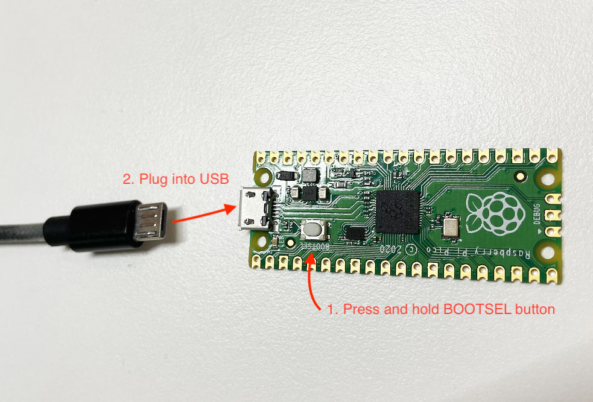
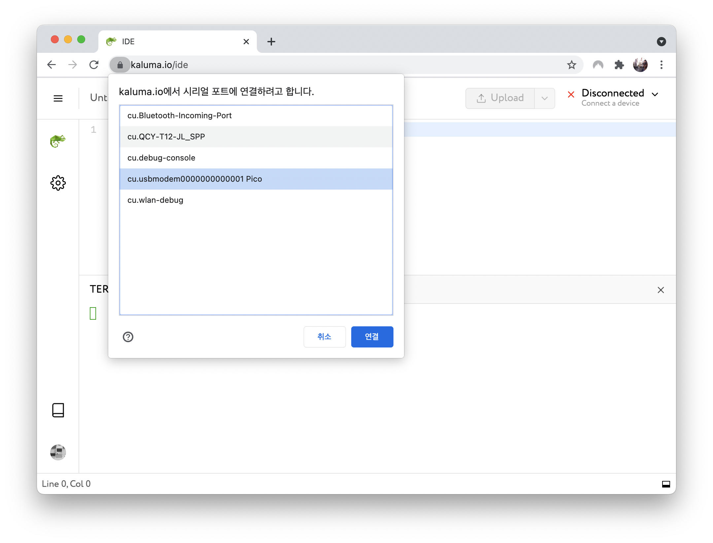
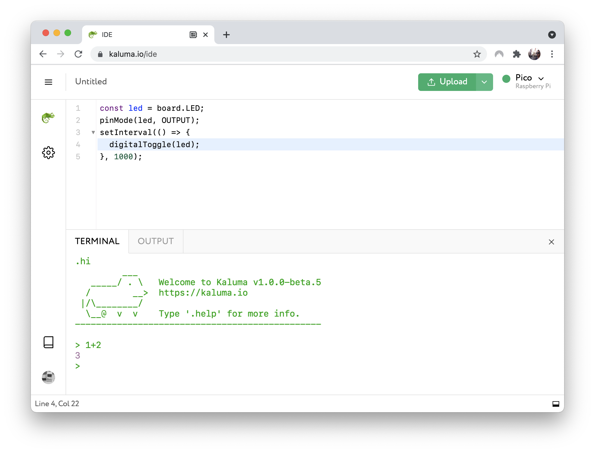
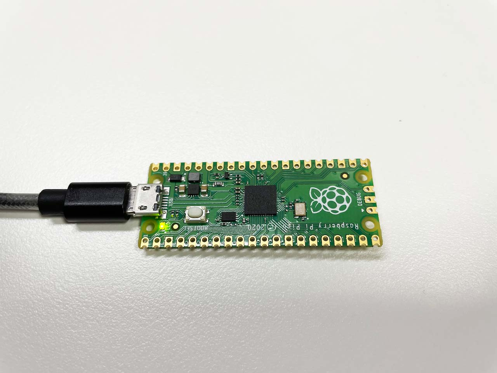

# Getting Started

Welcome to Kaluma! Kaluma is a tiny JavaScript platform for microcontrollers. If you are a JavaScript developer familiar with Node.js, you can make DIY electronics without learning a new language like C/C++ or Arduino sketch. In this article we will give you a quick tutorial to get start JavaScript programming with [Raspberry Pi Pico](https://www.raspberrypi.org/products/raspberry-pi-pico/).

## Upload firmware (.UF2)

You can upload Kaluma firmware to your Raspberry Pi Pico board by following steps.

1. Download Kaluma firmware `.UF2` file from [https://kaluma.io/download](https://kaluma.io/download).
2. Push and hold the `BOOTSEL` button and plug into USB port of your computer. Release the `BOOTSEL` button after connected. It will mount as as USB storage device named `RPI-RP2`.
3. Drag and drop the downloaded `.UF2` onto the `RPI-RP2` volume. Your Pico will reboot automatically.
4. Now Kaluma is running on your Pico.



From now on, we will explain how to write code using the [Kaluma IDE](ide.md). It provides various features including syntax checking, automatic code bundling, integrated terminal, etc. Nevertheless you want to write your code using text editor (e.g. VSCode, Sublime Text, Atom, Vim, etc.), you can use [CLI](cli.md).

## Open IDE

Now you are ready to code with Kaluma. Open IDE by visiting at [https://kaluma.io/ide](https://kaluma.io/ide) or clicking the IDE menu in the website. Then, connect a board by clicking the device select dropdown in the top-right area in the IDE. The IDE works only in web browsers supporting Web Serial API. We recommend to use Chrome or Edge browser.


If your device is not detected, try with [Kaluma Agent](https://kaluma.io/agent).




The IDE will try to communicate with the connected board and will show the welcome message received from the board in the Terminal area. In the terminal, you can use it as a JavaScript REPL (Read-Eval-Print Loop) mode. So you will get the result **3** when you enter **1+2**.



## Upload your code

We will write a code for blinking LED on the Raspberry Pi Pico board for every seconds. Enter the below code in the Editor area of IDE.

```javascript
var led = 25; // LED of Raspberry Pi Pico
pinMode(led, OUTPUT);
setInterval(() => {
  digitalToggle(led);
}, 1000);
```

To upload the code, click the “**Upload**” button. After a moment, you will see the blinking LED in the board.



Congratulation, now you have completed basic steps to use Kaluma. Please note that the code in IDE is not be saved. If you want to save the code, you can save the code as a project by selecting **Save** menu or press `Ctrl+S` shortcut.
